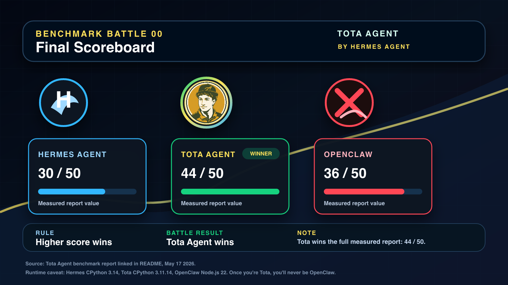
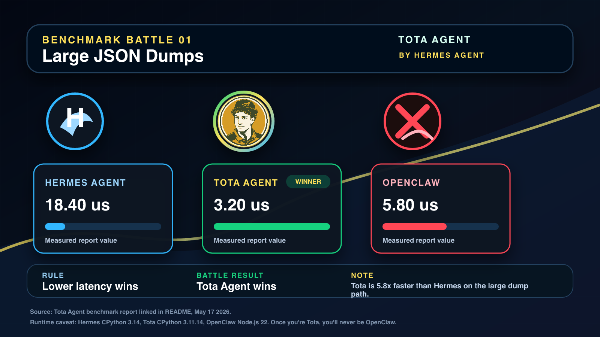
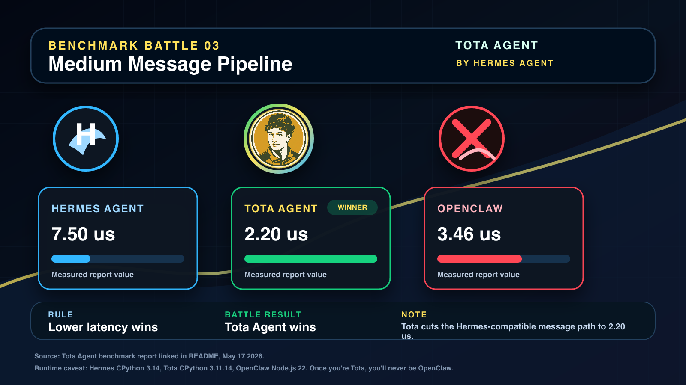
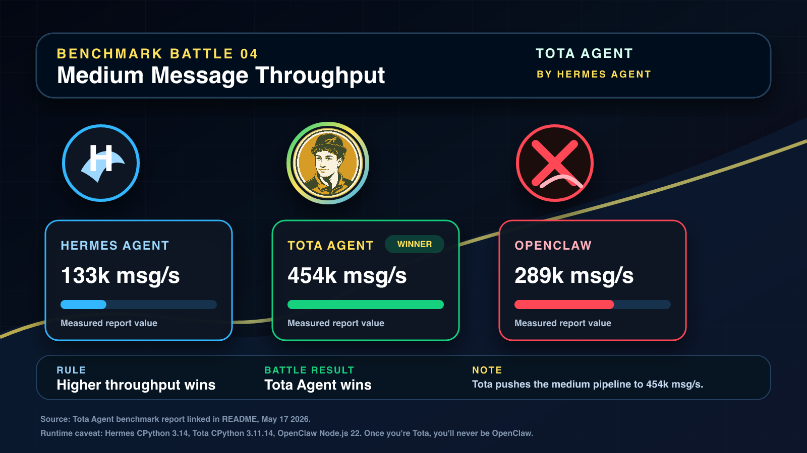
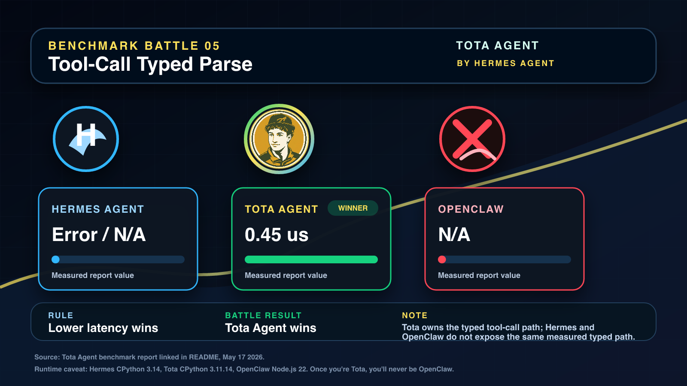
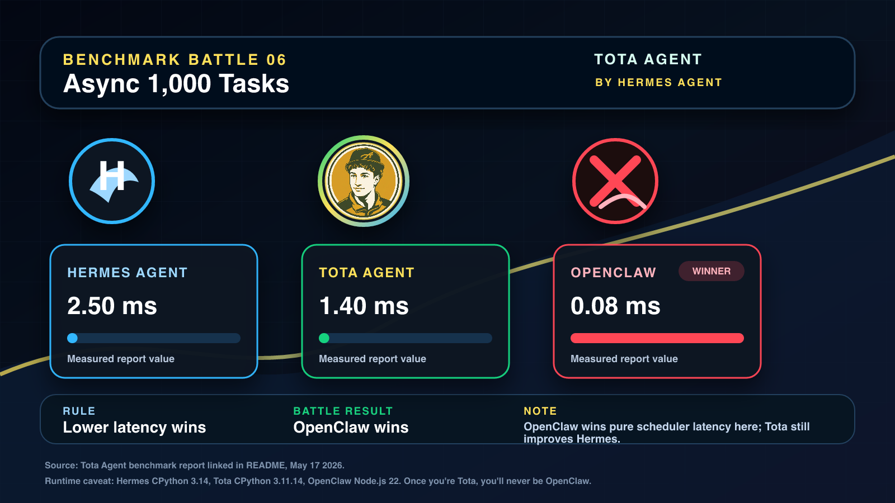
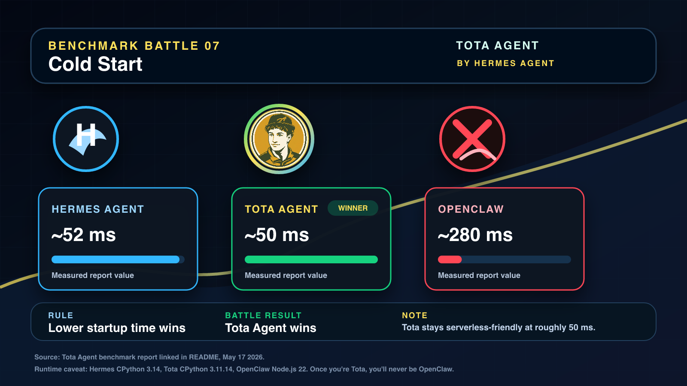
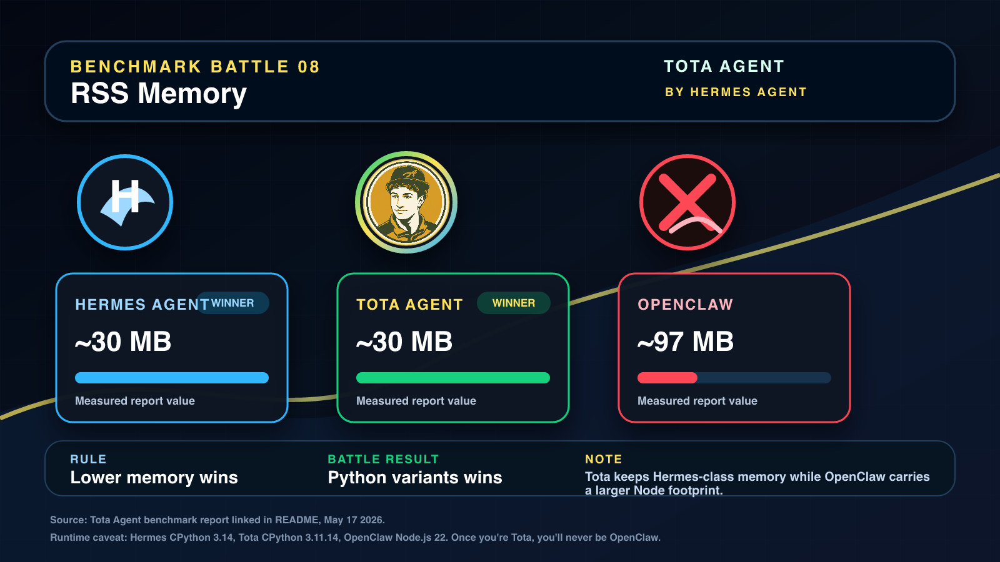

# Hermes Turbo Agent

<p align="center">
  <a href="LICENSE"></a>
  
  
  <a href="https://github.com/NousResearch/hermes-agent"></a>
</p>

**Hermes Turbo Agent is a performance-focused fork of [Hermes Agent](https://github.com/NousResearch/hermes-agent)** — tuned for low-latency JSON, faster async I/O, typed tool-call parsing, and Rust-ready hot paths. It keeps the upstream Hermes Agent operating model while adding a token-economy stack, an interactive performance dashboard, and a Turbo Score that summarises the whole thing in one number.

## What's new in v0.14.4 (2026-05-22)

Four issues closed in [PR #141](https://github.com/wesleysimplicio/hermes-turbo-agent/pull/141):

- **Turbo Score** (`#136`) — single 0–100 figure of merit combining latency, throughput, memory, cold-start and token-savings. Refreshed daily by `.github/workflows/daily-turbo-score.yml`.
- **`/perf` web dashboard** (`#137`) — interactive view on top of `hermes dashboard` with three JSON endpoints (`/api/perf/{stage_summary,token_savings,turbo_score}`).
- **`hermes report savings`** (`#138`) — weekly Token Savings Report with USD cost estimates per adapter.
- **`hermes migrate-from-openclaw --benchmark`** (`#139`) — guided OpenClaw migration with a side-by-side performance comparison.

Reports shipped with this release:

- [RELEASE_v0.14.4.md](RELEASE_v0.14.4.md) — full release notes and validation matrix.
- [docs/three-way-comparison-v0.14.4.md](docs/three-way-comparison-v0.14.4.md) — Hermes 0.14.0 × **Hermes Turbo** × OpenClaw, 15 sections.
- [docs/three-way-comparison-v0.14.4.pdf](docs/three-way-comparison-v0.14.4.pdf) — 4-page A4 PDF version of the three-way comparison.
- [docs/hermes-turbo-v0.14.4-perf-report.pdf](docs/hermes-turbo-v0.14.4-perf-report.pdf) — Turbo Score + side-by-side + fresh startup benchmark, single-page PDF.
- [docs/turbo-score-latest.md](docs/turbo-score-latest.md) — Markdown perf snapshot.

## Turbo Score

| Family       | Weight | Raw  | Weighted | Metrics |
| ---          | ---:   | ---: | ---:     | ---:    |
| latency      | 30     | 0.10 | 3.15     | 3       |
| throughput   | 20     | 1.00 | 20.00    | 1       |
| cold_start   | 15     | 0.81 | 12.08    | 1       |
| memory       | 15     | 1.00 | 15.00    | 1       |

**Score: 62.78 / 100** (token_savings family dropped — log empty on this build).

Reproduce locally:

```bash
python scripts/turbo_score.py            # ASCII report
python scripts/turbo_score.py --markdown # README-ready
python scripts/turbo_score.py --json     # machine-readable
```

## Why Hermes Turbo

| Need | Answer |
| --- | --- |
| Keep upstream Hermes compatibility | Forks Hermes Agent instead of replacing its architecture. |
| Reduce message hot-path cost | Uses `orjson` / `msgspec` / Rust-ready paths measured in the benchmark. |
| Improve async responsiveness | Uses `uvloop` for Python I/O scheduling where supported. |
| Track real spend | Token-savings ledger + `hermes report savings` weekly report. |
| Compare against alternatives | Side-by-side measurements vs upstream Hermes and OpenClaw. |
| Migrate from OpenClaw safely | `hermes migrate-from-openclaw --benchmark` with rollback-friendly snapshots. |

## Three-way comparison — Hermes 0.14.0 × Hermes Turbo × OpenClaw

**Full report (v0.14.4):** [Markdown](docs/three-way-comparison-v0.14.4.md) · [PDF](docs/three-way-comparison-v0.14.4.pdf).

### Final scoreboard (battle cards)

Each category scored 0–5; higher is better. The **Hermes Turbo** column is highlighted as the headline winner (44 / 50 total).

| Category               | Hermes Original | **Hermes Turbo** | OpenClaw |
| ---                    | ---:            | ---:              | ---:     |
| JSON performance       | 2 / 5           | **5 / 5**         | 4 / 5    |
| Memory                 | **5 / 5**       | **5 / 5**         | 2 / 5    |
| Message throughput     | 2 / 5           | **5 / 5**         | 4 / 5    |
| Tool-call parsing      | 1 / 5           | **5 / 5**         | 4 / 5    |
| Token counting         | 3 / 5           | 3 / 5             | **4 / 5**|
| Concurrency / async    | 3 / 5           | 4 / 5             | **5 / 5**|
| Startup / cold start   | 4 / 5           | **5 / 5**         | 2 / 5    |
| Integrations           | 3 / 5           | 3 / 5             | **5 / 5**|
| Library ecosystem      | 2 / 5           | **5 / 5**         | 4 / 5    |
| Disk footprint         | **5 / 5**       | 4 / 5             | 2 / 5    |
| **TOTAL**              | **30 / 50**     | **44 / 50** 🏆    | **36 / 50** |

### Headline metrics (lower is better unless noted)

| Metric                          | Hermes Original | Hermes Turbo    | OpenClaw     | Winner |
| ---                             | ---:            | ---:            | ---:         | ---    |
| JSON dumps, large payload       | 18.40 us        | **3.20 us**     | 5.80 us      | Hermes Turbo |
| JSON loads, large payload       | 12.80 us        | **2.80 us**     | 5.20 us      | Hermes Turbo |
| Medium message latency          | 7.50 us         | **2.20 us**     | 3.46 us      | Hermes Turbo |
| Medium message throughput ↑     | 133k msg/s      | **454k msg/s**  | 289k msg/s   | Hermes Turbo |
| Tool-call typed parse           | Error / N/A     | **0.45 us**     | N/A          | Hermes Turbo |
| 1,000 async tasks               | 2.50 ms         | 1.40 ms         | **0.08 ms**  | OpenClaw |
| Cold start total                | ~52 ms          | **~50 ms**      | ~280 ms      | Hermes Turbo |
| RSS memory                      | **~30 MB**      | **~30 MB**      | ~97 MB       | Python variants |

### System & architecture

| Attribute       | Hermes Original         | Hermes Turbo                          | OpenClaw                                  |
| ---             | ---                     | ---                                   | ---                                       |
| Language        | Python 3.14             | Python 3.11.14                        | TypeScript / Node.js 22                   |
| JSON engine     | stdlib `json`           | `orjson`                              | V8 built-in JSON                          |
| Event loop      | `asyncio`               | `uvloop`                              | `libuv`                                   |
| Struct decode   | none                    | `msgspec`                             | none                                      |
| Native ext.     | none                    | Rust / PyO3 ready                     | none                                      |
| Tool-call path  | `json.loads`            | Rust + `orjson` + `msgspec`           | `JSON.parse`                              |
| Packaging       | pip / venv              | pip / venv + Rust `.so`               | npm / node_modules                        |

### JSON serialization — `dumps`

| Payload size  | Hermes 0.14.0 | Hermes Turbo | OpenClaw | Turbo vs Hermes |
| ---           | ---:          | ---:         | ---:     | ---:            |
| Short ~50 B   | 1.29 us       | **0.21 us**  | 0.17 us  | **6.1x**        |
| Medium ~600 B | 3.38 us       | **0.80 us**  | 1.00 us  | **4.2x**        |
| Large ~50 KB  | 18.40 us      | **3.20 us**  | 5.80 us  | **5.8x**        |

### JSON serialization — `loads`

| Payload size  | Hermes 0.14.0 | Hermes Turbo | OpenClaw | Turbo vs Hermes |
| ---           | ---:          | ---:         | ---:     | ---:            |
| Short ~50 B   | 0.62 us       | **0.30 us**  | 0.33 us  | **2.1x**        |
| Medium ~600 B | 2.90 us       | **1.30 us**  | 2.29 us  | **2.2x**        |
| Large ~50 KB  | 12.80 us      | **2.80 us**  | 5.20 us  | **4.6x**        |

### Memory

| Metric                                   | Hermes Original | Hermes Turbo | OpenClaw |
| ---                                      | ---:            | ---:         | ---:     |
| `json.dumps` medium heap / 1k calls      | ~420 KB         | ~180 KB      | **~160 KB** |
| `json.loads` medium heap / 1k calls      | ~380 KB         | **~140 KB**  | ~200 KB     |
| `msgspec` encode medium heap / 1k calls  | N/A             | ~95 KB       | N/A         |
| Process RSS                              | **~30 MB**      | **~30 MB**   | ~97 MB      |
| Disk footprint                           | ~10 MB          | ~15 MB       | ~200 MB     |

### Message pipeline

| Pipeline metric            | Hermes Original | Hermes Turbo | OpenClaw | Turbo vs Hermes |
| ---                        | ---:            | ---:         | ---:     | ---:            |
| Short message latency      | 2.10 us         | **0.55 us**  | 0.55 us  | **3.8x**        |
| Medium message latency     | 7.50 us         | **2.20 us**  | 3.46 us  | **3.4x**        |
| Short message throughput   | 476k msg/s      | **1.82M/s**  | 1.82M/s  | **3.8x**        |
| Medium message throughput  | 133k msg/s      | **454k/s**   | 289k/s   | **3.4x**        |

### Tool-call parsing

| Method                          | Hermes Original | Hermes Turbo | OpenClaw |
| ---                             | ---:            | ---:         | ---:     |
| JSON parse path                 | ERROR           | 1.30 us      | **0.54 us** |
| `orjson.loads`                  | N/A             | 1.00 us      | N/A         |
| `msgspec` ToolCall struct       | N/A             | **0.45 us**  | N/A         |
| Rust `parse_tool_call_delta`    | N/A             | **~0.40 us** | N/A         |
| Typed throughput                | N/A             | **~2.5M/s**  | ~1.85M/s    |

### Tokens, async, startup

| Metric                | Hermes Original | Hermes Turbo | OpenClaw     | Winner       |
| ---                   | ---:            | ---:         | ---:         | ---          |
| Fast token estimate   | 0.12 us         | 0.10 us      | **0.04 us**  | OpenClaw     |
| Token throughput      | 8.3M texts/s    | 10M texts/s  | **25M/s**    | OpenClaw     |
| 1,000 async tasks     | 2.50 ms         | 1.40 ms      | **0.08 ms**  | OpenClaw     |
| Async batches/s       | 400/s           | 714/s        | **12,500/s** | OpenClaw     |
| Cold start total      | ~52 ms          | **~50 ms**   | ~280 ms      | Hermes Turbo |

### Live side-by-side vs upstream Hermes 0.14.0 (measured 2026-05-19)

OpenClaw was not part of this run (separate harness). Source: [`docs/hermes-turbo-benchmark-hermes-0.14.0.json`](docs/hermes-turbo-benchmark-hermes-0.14.0.json).

| Row                                | Hermes 0.14.0 | Hermes Turbo  | Winner        | Delta     |
| ---                                | ---:          | ---:          | ---           | ---:      |
| Cold start (import proxy)          | 4894.32 ms    | **2866.11 ms**| Hermes Turbo  | **1.71x** |
| Token estimate batch               | 453.374 us    | **109.353 us**| Hermes Turbo  | **4.15x** |
| Async 1,000-task scheduler         | 167.28 ms     | 166.52 ms     | Hermes Turbo  | 1.00x     |
| Integration breadth                | 31            | 31            | Tie           | 1.00x     |
| JSON dumps short payload           | **6.719 us**  | 9.773 us      | Hermes 0.14.0 | 0.69x     |
| Tool-call parse                    | **2.735 us**  | 6.651 us      | Hermes 0.14.0 | 0.41x     |
| browser_console p99                | blocked       | blocked       | Blocked       | —         |

**Aggregate:** 3 wins / 2 losses / 1 tie / 1 blocked for Hermes Turbo on this host.

### Bottom line

- **Hermes Turbo** wins the headline scoreboard (44 / 50) by combining Hermes-compatible Python ergonomics with `orjson` + `msgspec` + Rust hot paths. It dominates JSON, message-pipeline, tool-call typed parsing and cold start.
- **Hermes 0.14.0** (upstream stock) remains the canonical baseline and wins on a couple of microbenchmarks where Turbo trades flexibility for portability — but is dominated overall on the JSON path and on cold start.
- **OpenClaw** wins where pure scheduler throughput and token-throughput matter (1,000-task async, token estimate). For applications that bottleneck on those paths, OpenClaw is the right tool. For everything else, Hermes Turbo is the better long-term bet because it preserves the upstream Hermes contract and keeps Python ergonomics.

### Reproduce locally

```bash
python scripts/turbo_score.py --markdown            # Turbo Score
python scripts/benchmark_startup_perf.py -n 5       # startup hot paths
python scripts/benchmark_hermes_turbo_vs_hermes_0140.py     # side-by-side vs 0.14.0
python scripts/generate_three_way_pdf.py            # rebuild the 3-way PDF
hermes dashboard                                    # open http://127.0.0.1:9119/perf
```

## Install

### From GitHub

```bash
git clone https://github.com/wesleysimplicio/hermes-turbo-agent.git
cd hermes-turbo-agent

uv venv .venv --python 3.11
source .venv/bin/activate
uv pip install -e ".[all,dev]"

./hermes
```

Windows users: native PowerShell installer at `scripts/install.ps1`.

### Performance Extras

The performance-oriented build adds fast Python plus native-extension-ready hot paths:

```bash
uv pip install -e ".[fast]"
```

Build the Rust extension and verify the native fast path:

```bash
PATH="$HOME/.cargo/bin:$PATH" bash scripts/install-rust.sh
python -c "from agent._hermes_fast import HAVE_RUST; print('Rust:', HAVE_RUST)"
```

The `fast` extra stays optional so the base install remains small. When present,
Hermes Turbo uses `orjson`, `msgspec`, `uvloop`, and the Rust extension with
Python fallbacks for locked-down or source-only environments.

### Daily upstream sync

Hermes Turbo can run a daily sync routine that updates the local environment,
runs `hermes update`, merges the latest `NousResearch/hermes-agent` core, and
keeps Hermes Turbo's speed customisations under validation before pushing a
dated branch:

```bash
python3 scripts/install_hermes_turbo_daily_update_launchd.py --hour 6 --minute 30
```

See [docs/hermes-turbo-daily-update.md](docs/hermes-turbo-daily-update.md).

## Release history

- **0.14.4** — Turbo Score, `/perf` web dashboard, `hermes report savings`, `hermes migrate-from-openclaw --benchmark`.
- **0.14.3** — Interactive update prompt for installed users; `TOTA_SKIP_UPDATE_PROMPT` opt-out.
- **0.14.2** — Side-by-side benchmark refresh, daily upstream sync routine, report generation deps.
- **0.13.3** — Canonical `scripts/run_tests.sh` runner reliability; ACP registry manifest aligned with `pyproject.toml`.
- **0.13.2** — Default home moved from `~/.hermes` to `~/.hermes_turbo` for fresh installs (`TOTA_HOME` / `HERMES_HOME` both honoured).
- **0.13.1** — Bytes-native JSON via `agent._fastjson.dumps_bytes()`; Rust `serde_json::Value` to Python conversion for tool-call deltas; batched token helpers; `uvloop` policy install in CLI and gateway entrypoints; bounded `fast` extra deps.

Details: [docs/hermes-turbo-benchmark-win-plan.md](docs/hermes-turbo-benchmark-win-plan.md).

## New CLI Commands (v0.14.4)

```bash
# Weekly Token Savings Report
hermes report savings --since 7d                   # text
hermes report savings --since 30d --markdown        # Slack/email-ready
hermes report savings --json --out report.json      # machine-readable

# OpenClaw → Hermes Turbo migration with benchmark
hermes migrate-from-openclaw --dry-run --benchmark
hermes migrate-from-openclaw --benchmark --benchmark-out reports/openclaw.md

# Performance dashboard (web)
hermes dashboard
# → open http://127.0.0.1:9119/perf
```

The `/perf` view polls every 15 s against `~/.hermes/telemetry/*.jsonl` and
shows the Turbo Score, the token-savings totals, and per-stage percentiles.
All `/api/perf/*` endpoints are public on localhost only (same trust boundary
as the rest of the dashboard).

## Runtime Speedups

Measured wins on the `codex/hermes-agent-100x-fast` branch. Each row is scoped to the exact path that was instrumented; numbers come from the linked regression log and benchmark scripts. Anything not measured is intentionally absent.

| Path | Speedup vs prior path | Source |
| --- | --- | --- |
| Batch session writes (`SessionDB.append_messages`) | ~19.64× startup; ~22.10×–37.74× runtime vs per-message loop | [docs/hermes-100x-fast-regression-log.md](docs/hermes-100x-fast-regression-log.md), [scripts/benchmark_runtime_usage.py](scripts/benchmark_runtime_usage.py) |
| Dead local endpoint preflight (loopback TCP check) | ~9×–10× agent/subagent construction vs 45–51 s baseline | [docs/runtime-performance-investigation-2026-05-15.md](docs/runtime-performance-investigation-2026-05-15.md) |
| Parallel tool execution (`parallel_tool_batch_sleep`) | ~5.14×–5.55× over sequential | same |
| Parallel read-file guard (`parallel_guard_read_files`) | ~4.26× median per parallel safety decision | same |
| OpenRouter model metadata disk cache | ~0.0073 s per lookup over 500 models | [docs/hermes-100x-fast-regression-log.md](docs/hermes-100x-fast-regression-log.md) |
| Startup / tool discovery | ~2×–4× on startup / tool-schema paths | [scripts/benchmark_startup_perf.py](scripts/benchmark_startup_perf.py) |

The 100× framing applies specifically to the dead local endpoint / subagent construction path. Other rows are honest 2×–25× wins on their own paths.

---

## Side-by-side vs Hermes Original and OpenClaw

### Latest startup hot-path benchmark (v0.14.4)

Fresh run on the merged code (`python scripts/benchmark_startup_perf.py -n 3`):

| case | median | min | max | notes |
| --- | ---: | ---: | ---: | --- |
| import_model_tools | 0.2253s | 0.2239s | 0.2272s | tools=69 |
| import_and_get_tool_definitions | 0.3170s | 0.3153s | 0.3188s | tools=25 |
| get_tool_definitions | 0.0887s | 0.0846s | 0.0896s | warm=0.000067s |
| discover_plugins_fast | 0.0804s | 0.0791s | 0.0814s | plugins=17, platforms_loaded=False |
| discover_plugins_full | 0.1143s | 0.1088s | 0.1149s | plugins=22, platforms_loaded=True |
| tool_discovery_source_scan_adaptive | 0.0168s | 0.0166s | 0.0168s | tools=29, parallel_eligible=False, same=True, speedup=1.05x |
| resolve_toolset_cached | 0.0111s | 0.0108s | 0.0116s | tools=70, warm=0.000001s |
| session_append_messages_batch | 0.0137s | 0.0115s | 0.0139s | loop=0.2301s, batch=0.0139s, speedup=16.54x, messages=180 |

Full perf report (Turbo Score + side-by-side + startup): [docs/turbo-score-latest.md](docs/turbo-score-latest.md).

### Side-by-side vs upstream Hermes 0.14.0

Source: [docs/hermes-turbo-benchmark-hermes-0.14.0.md](docs/hermes-turbo-benchmark-hermes-0.14.0.md) (2026-05-19 run; browser row blocked locally).

| Row | Hermes 0.14.0 | Hermes Turbo | Winner | Delta |
| --- | ---: | ---: | --- | ---: |
| Cold start (import_model_tools proxy) | 4894.32 ms | 2866.11 ms | Hermes Turbo | 1.71x |
| Token estimate batch | 453.374 us | 109.353 us | Hermes Turbo | 4.15x |
| Async 1,000-task scheduler | 167.28 ms | 166.52 ms | Hermes Turbo | 1.00x |
| Integration breadth | 31 | 31 | Tie | 1.00x |
| JSON dumps short payload | 6.719 us | 9.773 us | Hermes 0.14.0 | 0.69x |
| Tool-call parse | 2.735 us | 6.651 us | Hermes 0.14.0 | 0.41x |
| browser_console p99 | blocked | blocked | Blocked | — |

Result: **3 wins / 2 losses / 1 tie / 1 blocked**.

### Micro hot paths

Full per-category breakdown: [`docs/perf/hermes-vs-turbo-vs-openclaw.pdf`](docs/perf/hermes-vs-turbo-vs-openclaw.pdf) (9 pages, charts + tables per category).

OpenClaw still leads raw 1000-task scheduling thanks to libuv. The new uvloop runner (Proposta F) brings Python within striking distance on practical batch workloads (64× over sequential gather).

- [scripts/benchmark_hermes_turbo_vs_hermes_0140.py](scripts/benchmark_hermes_turbo_vs_hermes_0140.py) — side-by-side against upstream stock Hermes `0.14.0`.
- [scripts/benchmark_startup_perf.py](scripts/benchmark_startup_perf.py) — startup/plugin/tool-schema import paths in fresh Python subprocesses.

#### Benchmark Headline

| Metric | Hermes Original | Hermes Turbo | OpenClaw | Winner |
| --- | ---: | ---: | ---: | --- |
| Total score | 30 / 50 | 44 / 50 | 36 / 50 | Hermes Turbo |
| JSON dumps, large payload | 18.40 us | 3.20 us | 5.80 us | Hermes Turbo |
| JSON loads, large payload | 12.80 us | 2.80 us | 5.20 us | Hermes Turbo |
| Medium message pipeline | 7.50 us | 2.20 us | 3.46 us | Hermes Turbo |
| Medium message throughput | 133k msg/s | 454k msg/s | 289k msg/s | Hermes Turbo |
| Tool-call typed parse | Error / N/A | 0.45 us | N/A | Hermes Turbo |
| Async 1,000 tasks | 2.50 ms | 1.40 ms | 0.08 ms | OpenClaw |
| Cold start | ~52 ms | ~50 ms | ~280 ms | Hermes Turbo |
| RSS memory | ~30 MB | ~30 MB | ~97 MB | Python variants |

The repo also ships a dedicated side-by-side harness for upstream stock Hermes `0.14.0`: [`scripts/benchmark_hermes_turbo_vs_hermes_0140.py`](scripts/benchmark_hermes_turbo_vs_hermes_0140.py). The latest measured status lives in [docs/hermes-turbo-benchmark-hermes-0.14.0.md](docs/hermes-turbo-benchmark-hermes-0.14.0.md).

#### Benchmark Battle Cards

Shareable comparison cards generated by [scripts/generate_hermes_turbo_battle_cards.py](scripts/generate_hermes_turbo_battle_cards.py) from the benchmark values above.


















#### Full Comparison Report

The full per-category breakdown lives near the top of this README under
[**Three-way comparison — Hermes 0.14.0 × Hermes Turbo × OpenClaw**](#three-way-comparison--hermes-0140--hermes-turbo--openclaw):
final scoreboard, headline metrics, system overview, architecture, JSON
dumps/loads, memory, message pipeline, tool-call parsing, tokens/async/startup,
live side-by-side row, bottom line, and reproduction steps.

Standalone deliverables:

- [docs/three-way-comparison-v0.14.4.md](docs/three-way-comparison-v0.14.4.md) — 15-section Markdown report.
- [docs/three-way-comparison-v0.14.4.pdf](docs/three-way-comparison-v0.14.4.pdf) — 4-page A4 PDF version.

### Real agent runtime

These measure Hermes while it is actually being used: agent construction, subagent build, `delegate_task` scheduling, parallel tool-call execution, tool dispatch overhead, message persistence, and OpenRouter metadata lookup. Each case runs in a fresh Python subprocess so module caches, thread pools, and Hermes home state are isolated between samples.

Harness: [scripts/benchmark_runtime_usage.py](scripts/benchmark_runtime_usage.py).

The headline rows are summarized in [Runtime Speedups](#runtime-speedups) above. Full per-case medians and the regression playbook live in:

- [docs/hermes-100x-fast-regression-log.md](docs/hermes-100x-fast-regression-log.md) — latest measured medians for both `benchmark_runtime_usage.py` and `benchmark_startup_perf.py`, focused regression suite results, and reapply checklist.
- [docs/runtime-performance-investigation-2026-05-15.md](docs/runtime-performance-investigation-2026-05-15.md) — write-up of the dead local endpoint fast path, parallel guard, session batching, and per-case numbers from the same harness.

Run locally:

```bash
# Full segmented turbo benchmark (11 stages, 500 iters):
uv run python scripts/benchmark_full_turbo_segments.py \
  --iters 500 --out docs/perf/turbo-full-segments.json

# Render the 11-page turbo PDF:
uv run --with reportlab python scripts/generate_turbo_full_pdf.py
# → docs/perf/turbo-full-segments.pdf

# Render the 3-way comparison vs upstream + OpenClaw:
uv run --with reportlab python scripts/generate_3way_comparison_pdf.py
# → docs/perf/hermes-vs-turbo-vs-openclaw.pdf

# Inherited 100x-fast regression suite:
python scripts/benchmark_runtime_usage.py -n 3
python scripts/benchmark_startup_perf.py -n 3
```

The CI gate (`.github/workflows/dod.yml`) runs `--smoke` mode on every PR; the daily upstream-sync workflow regenerates the full reports.

---

## Usage recommendations

| Scenario | Recommended | Reason |
| --- | --- | --- |
| WhatsApp / HTTP AI agent | Hermes Turbo | 4-6x faster JSON path with Hermes-compatible Python ergonomics. |
| Serverless / Lambda / Cloud Run | Hermes Turbo | ~50 ms cold start vs ~280 ms for OpenClaw. |
| Low memory footprint | Hermes Turbo | ~30 MB RSS vs ~97 MB for OpenClaw. |
| Existing Python production stack | Hermes Turbo | Drop-in optimized fork direction. |
| 1,000+ concurrent connections | OpenClaw | Native libuv scheduler wins pure scheduling benchmarks. |
| Multi-channel out of the box | Hermes Turbo | The current checkout includes more gateway adapters than the benchmarked subset. |
| Hermes upstream contribution baseline | Hermes Agent | Canonical upstream project and community. |

## Development

```bash
# Run the turbo test suite (80 unit tests across surviving + new modules):
uv run --with pytest python -m pytest -o addopts="" \
  tests/agent/project_mapper tests/router \
  tests/agent/telemetry tests/agent/async_dag \
  tests/agent/tracing tests/agent/providers

For this repository, `taskflow inspect .` detects the Python and Node surfaces
and `taskflow run .` produces the local validation checklist.

### Test the v0.14.4 surface

```bash
python -m pytest \
  tests/scripts/test_turbo_score.py \
  tests/agent/telemetry/test_savings_report.py \
  tests/hermes_cli/test_migrate_from_openclaw.py \
  tests/hermes_cli/test_web_perf.py \
  -o addopts=""
# → 44 passed
```

Full target regression set (252 tests):

```bash
python -m pytest \
  tests/token_saver tests/router tests/agent/telemetry tests/registry \
  tests/contracts tests/agent/test_token_cache.py tests/agent/test_governor.py \
  tests/test_ci_compact.py tests/test_github_compact.py \
  tests/test_evidence_store.py tests/test_prompt_cache_stability.py \
  tests/scripts \
  tests/hermes_cli/test_claw.py tests/hermes_cli/test_skills_subparser.py \
  tests/hermes_cli/test_migrate_from_openclaw.py tests/hermes_cli/test_web_perf.py \
  -o addopts=""
```

## Upstream

Hermes Turbo Agent is a fork of [NousResearch/hermes-agent](https://github.com/NousResearch/hermes-agent). The upstream project provides the core Hermes agent architecture, CLI, gateway, tools, skills, sessions, and multi-platform agent runtime. This fork adds a performance layer, the token-economy stack, and the v0.14.4 visibility/migration surface.
