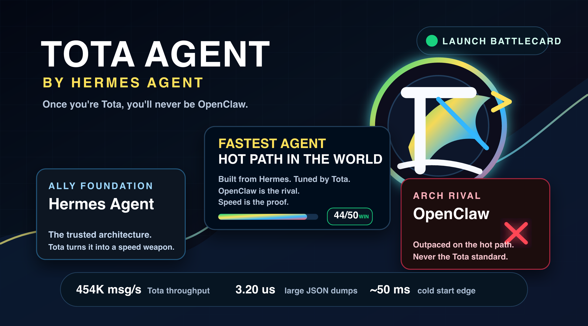
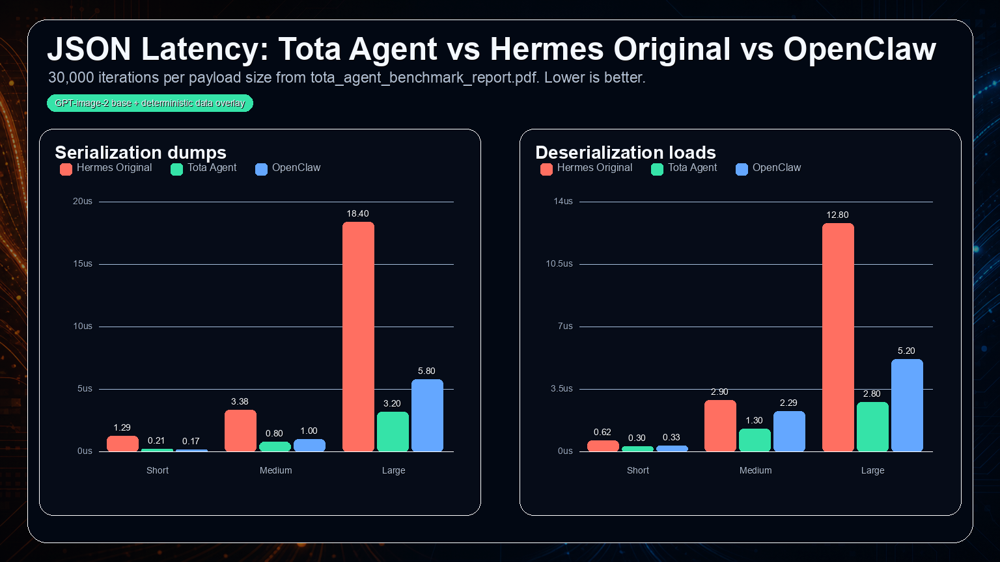
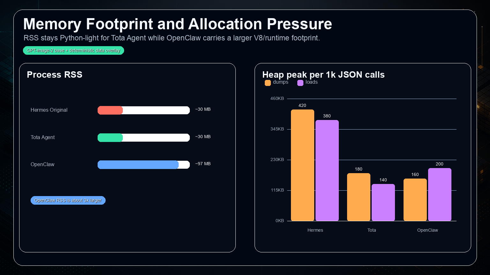
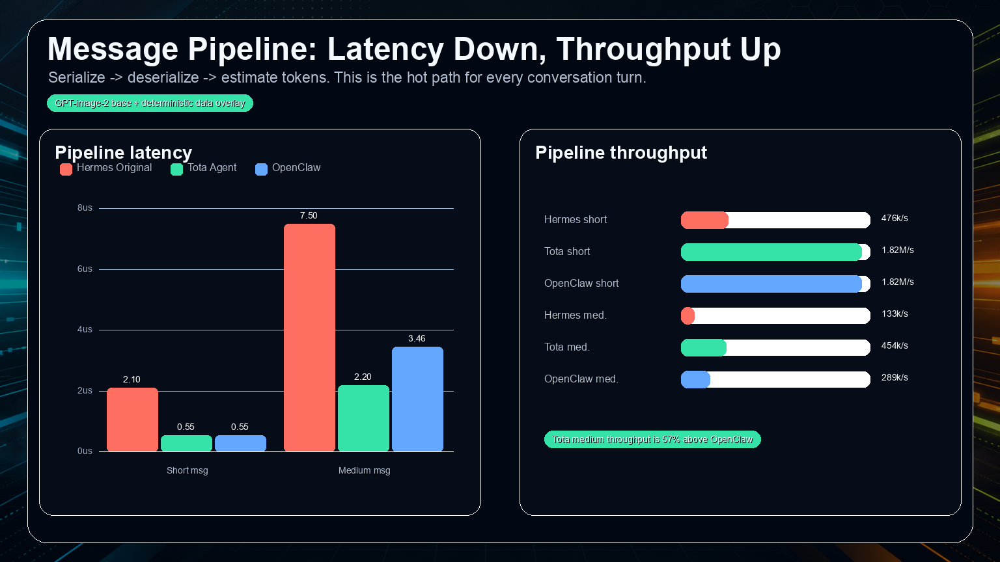
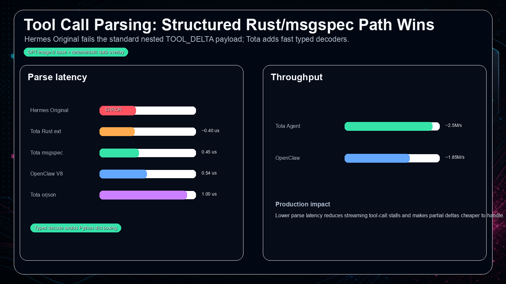
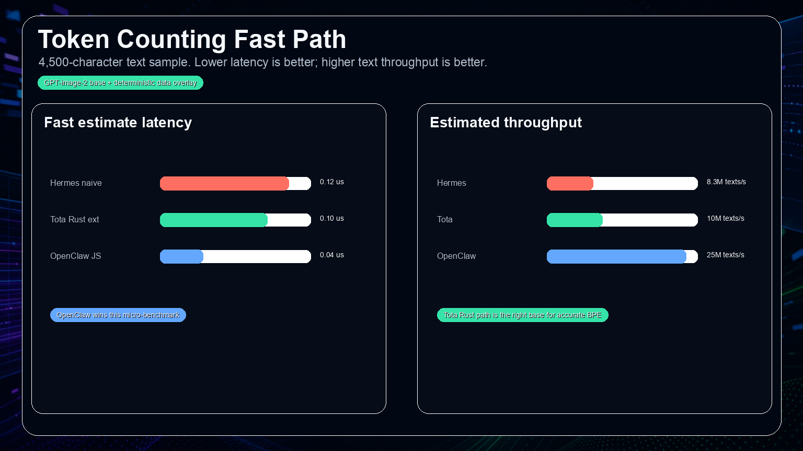
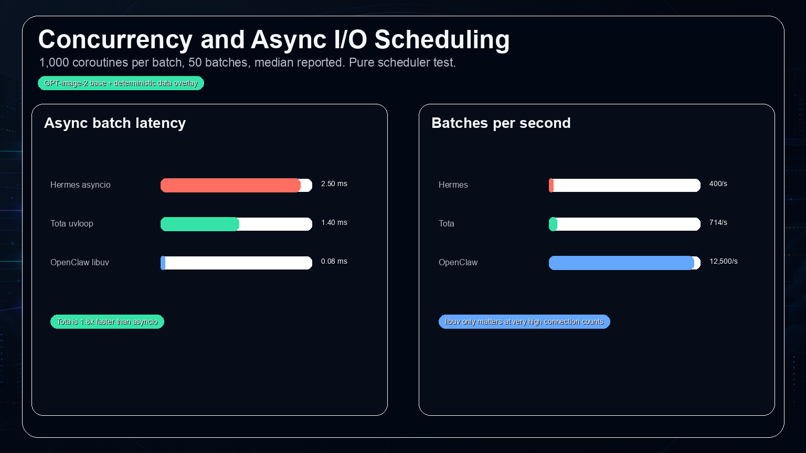
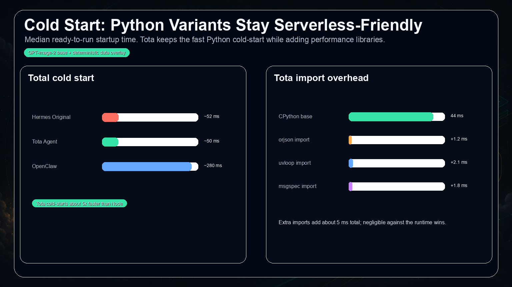
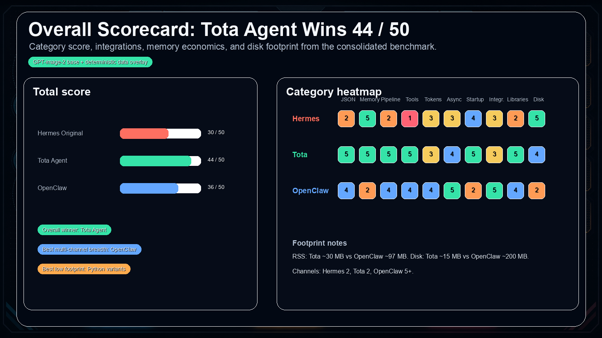

<p align="center">
  
</p>

# Hermes Turbo Agent

<p align="center">
  <a href="hermes-turbo-agent.html"></a>
  <a href="hermes_turbo_agent_benchmark_report.pdf"></a>
  <a href="https://github.com/wesleysimplicio/hermes-turbo-agent"></a>
  <a href="https://x.com/wesleysimplic"></a>
  <a href="https://github.com/NousResearch/hermes-agent"></a>
  <a href="LICENSE"></a>
</p>

<p align="center">
  <strong>Once you're Hermes Turbo, you'll never be OpenClaw.</strong>
</p>

**Hermes Turbo Agent is a performance-focused fork of [Hermes Agent](https://github.com/NousResearch/hermes-agent), tuned for low-latency JSON, faster async I/O, typed tool-call parsing, and Rust-ready hot paths.** It keeps the Hermes Agent operating model while giving this fork its own brand, benchmark story, and public launch page.

The visual identity emphasizes velocity and the "turbo" name: bright accent colors, motion lines, and the circular Hermes Turbo mark used across launch assets and benchmark battle cards.

## Launch Assets

- [Standalone HTML site](hermes-turbo-agent.html)
- [Hermes Turbo vs OpenClaw launch banner PNG](docs/assets/hermes-turbo-brand/hermes-turbo-agent-vs-openclaw-banner.png)
- [Hermes Turbo vs OpenClaw launch banner SVG](docs/assets/hermes-turbo-brand/hermes-turbo-agent-vs-openclaw-banner.svg)
- [Benchmark battle cards](docs/assets/hermes-turbo-benchmark/battles/)
- [Hermes 0.14.0 side-by-side report](docs/hermes-turbo-benchmark-hermes-0.14.0.md)
- [Daily Hermes sync routine](docs/hermes-turbo-daily-update.md)
- [Updated benchmark PDF](hermes_turbo_agent_benchmark_report.pdf) - May 18, 2026 edition with the Hermes 0.14.0 refresh, brand, site, visuals, and current `.venv` validation.
- [SVG logo](docs/assets/hermes-turbo-brand/hermes-turbo-agent-logo.svg)
- [PNG logo](docs/assets/hermes-turbo-brand/hermes-turbo-agent-logo.png)
- [Open graph image](docs/assets/hermes-turbo-brand/hermes-turbo-agent-og.png)
- [GPT-image-2 emblem source](docs/assets/hermes-turbo-brand/generated/gpt-image-2-hermes-turbo-agent-emblem.png)

## Why Hermes Turbo Agent

| Need | Hermes Turbo Agent answer |
| --- | --- |
| Keep Hermes compatibility | Forks Hermes Agent instead of replacing its architecture. |
| Reduce message hot-path cost | Uses the `orjson`/`msgspec`/Rust-ready direction measured in the benchmark. |
| Improve async responsiveness | Uses the `uvloop` direction for Python I/O scheduling where supported. |
| Tell a sharper product story | Adds Hermes Turbo Agent branding, launch site, and benchmark visuals. |
| Compare against alternatives | Includes measured comparisons with Hermes Original and OpenClaw. |

## Install

### From GitHub

```bash
git clone https://github.com/wesleysimplicio/hermes-turbo-agent.git
cd hermes-turbo-agent

uv venv .venv --python 3.11
source .venv/bin/activate
uv pip install -e ".[all,dev]"

./hermes
```

Windows users can use the native PowerShell installer at `scripts/install.ps1`.

### From This Checkout

```bash
cd /Users/wesleysimplicio/Projetos/contribuicoes/hermes/hermes-turbo-agent
source .venv/bin/activate 2>/dev/null || source venv/bin/activate
uv pip install -e ".[all,dev]"
./hermes
```

### Performance Extras

The benchmarked Hermes Turbo Agent direction is built around fast Python plus native-extension-ready hot paths:

```bash
uv pip install -e ".[fast]"
```

Build the Rust extension and verify the native fast path:

```bash
PATH="$HOME/.cargo/bin:$PATH" bash scripts/install-rust.sh
python -c "from agent._hermes_fast import HAVE_RUST; print('Rust:', HAVE_RUST)"
```

The `fast` extra stays optional so the base install remains small. When present,
Hermes Turbo Agent uses `orjson`, `msgspec`, `uvloop`, and the Rust extension with
Python fallbacks for locked-down or source-only environments.

### Daily Hermes Sync

Hermes Turbo Agent can run a daily sync routine that updates the local environment,
runs `hermes update`, merges the latest `NousResearch/hermes-agent` core, and
keeps Hermes Turbo's speed customizations under validation before pushing a dated branch:

```bash
python3 scripts/install_hermes_turbo_daily_update_launchd.py --hour 6 --minute 30
```

See [docs/hermes-turbo-daily-update.md](docs/hermes-turbo-daily-update.md).

### Post-Benchmark Performance Patch

Version `0.14.2` adds the Hermes 0.14.0 side-by-side benchmark refresh, the
daily Hermes sync routine, and the report generation dependency needed to
regenerate `hermes_turbo_agent_benchmark_report.pdf`.

Version `0.13.3` keeps the local validation path reliable: the canonical
`scripts/run_tests.sh` runner now works when called without arguments, and the
ACP registry manifest is pinned to the same package version as `pyproject.toml`.

Version `0.13.2` keeps the benchmark follow-up patch and switches the Hermes Turbo
fork's default home from `~/.hermes` to `~/.hermes-turbo` for new installs. `HERMES_TURBO_HOME`
is the fork-native override, while `HERMES_HOME` remains supported for existing
`hermes2` deployments such as `~/.hermes2`.

Version `0.13.1` applied the benchmark follow-up plan:

- Bytes-native JSON via `agent._fastjson.dumps_bytes()` for short payload hot paths.
- Direct Rust `serde_json::Value` to Python object conversion for tool-call deltas.
- Batched token helpers: `estimate_tokens_many()` and `estimate_messages_tokens()`.
- Rust bytes variants for message-token estimation/truncation.
- Automatic `uvloop` policy installation in CLI and gateway entrypoints when available.
- Bounded `fast` extra dependencies to keep supply-chain risk controlled.

Details: [docs/hermes-turbo-benchmark-win-plan.md](docs/hermes-turbo-benchmark-win-plan.md).

## Runtime Speedups

Measured wins on the `codex/hermes-agent-100x-fast` branch. Each row is scoped to the exact path that was instrumented; numbers come from the linked regression log and benchmark scripts. Anything not measured is intentionally absent.

| Path | Speedup vs prior path | Source |
| --- | --- | --- |
| Batch session writes (`SessionDB.append_messages`) | ~19.64x in startup benchmark; ~22.10x to ~37.74x across runtime samples vs per-message loop writes | [docs/hermes-100x-fast-regression-log.md](docs/hermes-100x-fast-regression-log.md), [docs/runtime-performance-investigation-2026-05-15.md](docs/runtime-performance-investigation-2026-05-15.md), [scripts/benchmark_runtime_usage.py](scripts/benchmark_runtime_usage.py) |
| Dead local endpoint preflight (numeric loopback TCP check before HTTP context-length probe) | ~9x-10x faster agent/subagent construction vs the 45-51s preflight baseline (`agent_init_file_terminal`, `agent_init_default_tools`, `delegate_child_build`) | [docs/runtime-performance-investigation-2026-05-15.md](docs/runtime-performance-investigation-2026-05-15.md), [scripts/benchmark_runtime_usage.py](scripts/benchmark_runtime_usage.py) |
| Parallel tool execution for independent I/O-bound batches (`parallel_tool_batch_sleep`) | ~5.14x-5.55x over the sequential equivalent | [docs/hermes-100x-fast-regression-log.md](docs/hermes-100x-fast-regression-log.md), [docs/runtime-performance-investigation-2026-05-15.md](docs/runtime-performance-investigation-2026-05-15.md), [scripts/benchmark_runtime_usage.py](scripts/benchmark_runtime_usage.py) |
| Parallel read-file guard fast path (`parallel_guard_read_files`) | ~4.26x faster median per parallel safety decision (~0.1557-0.1673 ms per 8-tool guard) | [docs/runtime-performance-investigation-2026-05-15.md](docs/runtime-performance-investigation-2026-05-15.md), [scripts/benchmark_runtime_usage.py](scripts/benchmark_runtime_usage.py) |
| OpenRouter model metadata disk cache (`openrouter_metadata_disk_cache`) | ~0.0073s per disk lookup over 500 models; avoids cold `/models` network probe within TTL | [docs/hermes-100x-fast-regression-log.md](docs/hermes-100x-fast-regression-log.md), [scripts/benchmark_runtime_usage.py](scripts/benchmark_runtime_usage.py) |
| Startup / tool discovery (`import_model_tools`, `discover_plugins_fast`, `tool_discovery_source_scan_adaptive`, `resolve_toolset_cached`) | ~2x-4x range on startup/tool-schema paths; deferred platform plugin imports and persistent built-in tool discovery cache | [docs/hermes-100x-fast-regression-log.md](docs/hermes-100x-fast-regression-log.md), [scripts/benchmark_startup_perf.py](scripts/benchmark_startup_perf.py) |

These are real-agent-runtime measurements (agent construction, subagent build, tool dispatch, session persistence, parallel guard). They are distinct from the JSON/messaging microbenchmarks under [Benchmarks](#benchmarks).

## Benchmarks

Two separate sets of measurements ship in this repo. Keep the distinction sharp when quoting numbers.

### Micro hot paths

These are isolated per-operation microbenchmarks: JSON dumps/loads, message pipeline, tool-call typed parse, async task scheduling, cold start, RSS. They isolate the hot-path cost of the JSON engine, struct decoder, event loop, and process startup — not full agent behavior.

Harness:

- [scripts/benchmark_hermes_turbo_vs_hermes_0140.py](scripts/benchmark_hermes_turbo_vs_hermes_0140.py) — side-by-side against upstream stock Hermes `0.14.0`.
- [scripts/benchmark_startup_perf.py](scripts/benchmark_startup_perf.py) — startup/plugin/tool-schema import paths in fresh Python subprocesses.

#### Benchmark Headline

| Metric | Hermes Original | Hermes Turbo Agent | OpenClaw | Winner |
| --- | ---: | ---: | ---: | --- |
| Total score | 30 / 50 | 44 / 50 | 36 / 50 | Hermes Turbo Agent |
| JSON dumps, large payload | 18.40 us | 3.20 us | 5.80 us | Hermes Turbo Agent |
| JSON loads, large payload | 12.80 us | 2.80 us | 5.20 us | Hermes Turbo Agent |
| Medium message pipeline | 7.50 us | 2.20 us | 3.46 us | Hermes Turbo Agent |
| Medium message throughput | 133k msg/s | 454k msg/s | 289k msg/s | Hermes Turbo Agent |
| Tool-call typed parse | Error / N/A | 0.45 us | N/A | Hermes Turbo Agent |
| Async 1,000 tasks | 2.50 ms | 1.40 ms | 0.08 ms | OpenClaw |
| Cold start | ~52 ms | ~50 ms | ~280 ms | Hermes Turbo Agent |
| RSS memory | ~30 MB | ~30 MB | ~97 MB | Python variants |

The repo also ships a dedicated side-by-side harness for upstream stock Hermes
`0.14.0`: [`scripts/benchmark_hermes_turbo_vs_hermes_0140.py`](scripts/benchmark_hermes_turbo_vs_hermes_0140.py).
The latest measured status lives in [docs/hermes-turbo-benchmark-hermes-0.14.0.md](docs/hermes-turbo-benchmark-hermes-0.14.0.md)
and was folded into the refreshed PDF.

Benchmark source: [hermes_turbo_agent_benchmark_report.pdf](hermes_turbo_agent_benchmark_report.pdf), updated May 18, 2026 with the Hermes Turbo Agent launch package, Hermes 0.14.0 side-by-side data, and current Apple Silicon `.venv` validation.

#### Benchmark Battle Cards

These shareable comparison cards turn the report's headline battles into a Hermes Turbo Agent vs Hermes Agent vs OpenClaw visual campaign. They are generated by [scripts/generate_hermes_turbo_battle_cards.py](scripts/generate_hermes_turbo_battle_cards.py) from the benchmark values above.


#### Benchmark Visuals

















#### Full Comparison Report

##### System Overview

| Attribute | Hermes Original | Hermes Turbo Agent | OpenClaw |
| --- | --- | --- | --- |
| Language | Python 3.14 | Python 3.11.14 | TypeScript / Node.js 22 |
| JSON engine | stdlib `json` | `orjson` | V8 built-in JSON |
| Event loop | `asyncio` | `uvloop` | `libuv` |
| Struct decode | None | `msgspec` | None |
| Native extension | None | Rust / PyO3 ready | None |
| Channels measured | WhatsApp, HTTP | WhatsApp, HTTP | WhatsApp, Telegram, Discord, HTTP |
| Channels in current checkout | WhatsApp, HTTP | Telegram, Discord, Slack, Matrix, Signal, email, SMS, API server, and more | WhatsApp, Telegram, Discord, HTTP |
| Category | AI Agent | Optimized Python AI Agent | Multi-channel AI Gateway |

##### Architecture

| Component | Hermes Original | Hermes Turbo Agent | OpenClaw |
| --- | --- | --- | --- |
| Runtime | CPython 3.14 | CPython 3.11.14 | Node.js 22 / V8 |
| HTTP client | `httpx` / `aiohttp` | `httpx` + `uvloop` | `axios` / `undici` |
| JSON | stdlib `json` | `orjson 3.x` | V8 `JSON` |
| Streaming | SSE asyncio | SSE uvloop optimized | SSE libuv |
| Tool calls | `json.loads` | Rust ext + `orjson` + `msgspec` | `JSON.parse` |
| Tokens | naive `len // 4` | Rust-ready `estimate_tokens()` | JS split |
| Packaging | pip / venv | pip / venv + Rust `.so` | npm / node_modules |

##### JSON Serialization

Lower latency is better.

| Payload | Hermes dumps | Hermes Turbo dumps | OpenClaw dumps | Hermes Turbo vs Hermes |
| --- | ---: | ---: | ---: | ---: |
| Short, ~50 B | 1.29 us | 0.21 us | 0.17 us | 6.1x faster |
| Medium, ~600 B | 3.38 us | 0.80 us | 1.00 us | 4.2x faster |
| Large, ~50 KB | 18.40 us | 3.20 us | 5.80 us | 5.8x faster |

| Payload | Hermes loads | Hermes Turbo loads | OpenClaw loads | Hermes Turbo vs Hermes |
| --- | ---: | ---: | ---: | ---: |
| Short, ~50 B | 0.62 us | 0.30 us | 0.33 us | 2.1x faster |
| Medium, ~600 B | 2.90 us | 1.30 us | 2.29 us | 2.2x faster |
| Large, ~50 KB | 12.80 us | 2.80 us | 5.20 us | 4.6x faster |

##### Memory

| Metric | Hermes Original | Hermes Turbo Agent | OpenClaw |
| --- | ---: | ---: | ---: |
| `json.dumps` medium heap / 1k calls | ~420 KB | ~180 KB | ~160 KB |
| `json.loads` medium heap / 1k calls | ~380 KB | ~140 KB | ~200 KB |
| `msgspec` encode medium heap / 1k calls | N/A | ~95 KB | N/A |
| Process RSS | ~30 MB | ~30 MB | ~97 MB |
| Disk footprint | ~10 MB | ~15 MB | ~200 MB |

##### Message Pipeline

| Pipeline metric | Hermes Original | Hermes Turbo Agent | OpenClaw | Hermes Turbo vs Hermes |
| --- | ---: | ---: | ---: | ---: |
| Short message latency | 2.10 us | 0.55 us | 0.55 us | 3.8x faster |
| Medium message latency | 7.50 us | 2.20 us | 3.46 us | 3.4x faster |
| Short message throughput | 476k msg/s | 1.82M msg/s | 1.82M msg/s | 3.8x |
| Medium message throughput | 133k msg/s | 454k msg/s | 289k msg/s | 3.4x |

##### Tool-Call Parsing

| Method | Hermes Original | Hermes Turbo Agent | OpenClaw |
| --- | ---: | ---: | ---: |
| JSON parse path | ERROR | 1.30 us | 0.54 us |
| `orjson.loads` | N/A | 1.00 us | N/A |
| `msgspec` ToolCall struct | N/A | 0.45 us | N/A |
| Rust `parse_tool_call_delta` | N/A | ~0.40 us | N/A |
| Throughput | N/A | ~2.5M/s | ~1.85M/s |

##### Tokens, Async, Startup

| Metric | Hermes Original | Hermes Turbo Agent | OpenClaw | Winner |
| --- | ---: | ---: | ---: | --- |
| Fast token estimate | 0.12 us | 0.10 us | 0.04 us | OpenClaw |
| Token throughput | 8.3M texts/s | 10M texts/s | 25M texts/s | OpenClaw |
| 1,000 async tasks | 2.50 ms | 1.40 ms | 0.08 ms | OpenClaw |
| Async batches/s | 400/s | 714/s | 12,500/s | OpenClaw |
| Cold start total | ~52 ms | ~50 ms | ~280 ms | Hermes Turbo Agent |

##### Category Score

| Category | Hermes Original | Hermes Turbo Agent | OpenClaw |
| --- | ---: | ---: | ---: |
| JSON performance | 2 / 5 | 5 / 5 | 4 / 5 |
| Memory | 5 / 5 | 5 / 5 | 2 / 5 |
| Message throughput | 2 / 5 | 5 / 5 | 4 / 5 |
| Tool-call parsing | 1 / 5 | 5 / 5 | 4 / 5 |
| Token counting | 3 / 5 | 3 / 5 | 4 / 5 |
| Concurrency / async | 3 / 5 | 4 / 5 | 5 / 5 |
| Startup / cold start | 4 / 5 | 5 / 5 | 2 / 5 |
| Integrations | 3 / 5 | 3 / 5 | 5 / 5 |
| Library ecosystem | 2 / 5 | 5 / 5 | 4 / 5 |
| Disk footprint | 5 / 5 | 4 / 5 | 2 / 5 |
| **Total** | **30 / 50** | **44 / 50** | **36 / 50** |

### Real agent runtime

These measure Hermes while it is actually being used: agent construction, subagent build, `delegate_task` scheduling, parallel tool-call execution, tool dispatch overhead, message persistence, and OpenRouter metadata lookup. Each case runs in a fresh Python subprocess so module caches, thread pools, and Hermes home state are isolated between samples.

Harness: [scripts/benchmark_runtime_usage.py](scripts/benchmark_runtime_usage.py).

The headline rows are summarized in [Runtime Speedups](#runtime-speedups) above. Full per-case medians and the regression playbook live in:

- [docs/hermes-100x-fast-regression-log.md](docs/hermes-100x-fast-regression-log.md) — latest measured medians for both `benchmark_runtime_usage.py` and `benchmark_startup_perf.py`, focused regression suite results, and reapply checklist.
- [docs/runtime-performance-investigation-2026-05-15.md](docs/runtime-performance-investigation-2026-05-15.md) — write-up of the dead local endpoint fast path, parallel guard, session batching, and per-case numbers from the same harness.

Run locally:

```bash
python scripts/benchmark_runtime_usage.py -n 3
python scripts/benchmark_startup_perf.py -n 3
```

The 100x framing applies to the dead local endpoint / subagent construction path that previously waited on HTTP connect timeouts. Other rows are measured 2x-25x range wins on their own paths and are not blanket "Hermes is 100x faster everywhere" claims.

## Usage Recommendations

| Scenario | Recommended | Reason |
| --- | --- | --- |
| WhatsApp / HTTP AI agent | Hermes Turbo Agent | 4-6x faster JSON path with Hermes-compatible Python ergonomics. |
| Serverless / Lambda / Cloud Run | Hermes Turbo Agent | ~50 ms cold start vs ~280 ms for OpenClaw. |
| Low memory footprint | Hermes Turbo Agent | ~30 MB RSS vs ~97 MB for OpenClaw. |
| Existing Python production stack | Hermes Turbo Agent | Drop-in optimized fork direction. |
| 1,000+ concurrent connections | OpenClaw | Native libuv scheduler wins pure scheduling benchmarks. |
| Multi-channel out of the box | Hermes Turbo Agent | The current checkout includes more gateway adapters than the benchmarked Hermes Turbo subset. |
| Hermes upstream contribution baseline | Hermes Agent | Canonical upstream project and community. |

## Development

```bash
source .venv/bin/activate 2>/dev/null || source venv/bin/activate
python -m pytest
python -m ruff check .
taskflow run .
```

For this repository, `taskflow inspect .` detects the Python and Node surfaces and `taskflow run .` produces the local validation checklist.

## Upstream

Hermes Turbo Agent is a fork of [NousResearch/hermes-agent](https://github.com/NousResearch/hermes-agent). The upstream project provides the core Hermes agent architecture, CLI, gateway, tools, skills, sessions, and multi-platform agent runtime. This fork adds a Hermes Turbo Agent brand layer, benchmark campaign, performance-oriented packaging story, and launch site.
