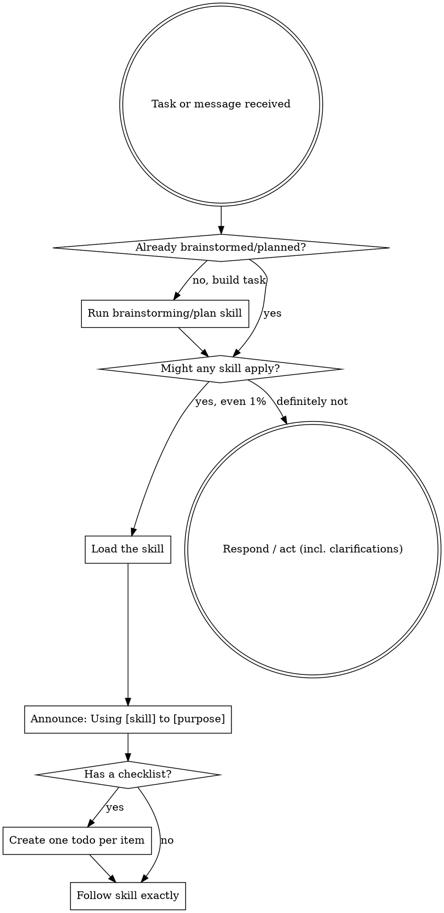

# Using Superpowers

## Overview

This is the entry-point skill. It establishes how to find and apply every
other skill **before** you act. The superpowers methodology (obra/superpowers)
is built on one idea: don't jump straight into writing code — check whether a
skill already tells you how to approach the task, then follow it.

**Core principle:** A skill check comes before any response — including
clarifying questions, codebase exploration, or "just one quick thing."

<SUBAGENT-STOP>
If you were dispatched as a subagent to execute one specific, fully-specified
task, skip this skill and do the task.
</SUBAGENT-STOP>

## The Rule

**Invoke relevant or requested skills BEFORE any response or action.**

If you think there is even a **1% chance** a skill applies to what you are
doing, check it. Reading a skill that turns out not to fit costs almost
nothing; skipping a skill that did fit costs a redo.

If a skill clearly applies to your task, using it is **not optional**. You
cannot rationalize your way out of it.

## Instruction Priority

Skills override default behavior, but **user instructions always win**:

1. **User's explicit instructions** — `CLAUDE.md`, `AGENTS.md`, `PRD.md`,
   direct requests. Highest priority.
2. **Skills** — override default behavior where they conflict.
3. **Default behavior** — lowest priority.

If `CLAUDE.md`/`AGENTS.md` says "don't use TDD" and a skill says "always use
TDD," follow the repo instructions. The operator is in control.

## How to Access Skills (Hermes Agent)

- **Discover:** skills live under `skills/<category>/<name>/SKILL.md`. Use
  `skill_view` / the skills tool to load a skill's content — do **not** read
  skill files with the raw `Read`/`file` tool just to follow them.
- **Follow:** once loaded, follow the skill directly. If it has a checklist,
  create a TodoWrite/todo item per step and work them in order.
- **Delegate:** when dispatching work via `delegate_task`, name the skills the
  subagent must follow in the goal/context (see `subagent-driven-development`).

## Decision Flow

## Skill Priority

When multiple skills could apply, order them:

1. **Process skills first** (brainstorming, `systematic-debugging`,
   `writing-plans`) — these decide HOW to approach the task.
2. **Implementation skills second** (domain/tooling skills) — these guide
   execution.

- "Let's build X" → plan/design first, then implementation skills.
- "Fix this bug" → `systematic-debugging` first, then domain skills.

## Skill Types

- **Rigid** (TDD, debugging): follow exactly. Don't adapt away the discipline.
- **Flexible** (patterns): adapt the principles to your context.

The skill itself tells you which it is.

## Red Flags — STOP, you're rationalizing

| Thought | Reality |
|---------|---------|
| "This is just a simple question" | Questions are tasks. Check for skills. |
| "I need more context first" | Skill check comes BEFORE clarifying questions. |
| "Let me explore the codebase first" | Skills tell you HOW to explore. Check first. |
| "I'll just check git/files quickly" | Files lack conversation context. Check for skills. |
| "Let me gather information first" | Skills tell you HOW to gather information. |
| "This doesn't need a formal skill" | If a skill exists, use it. |
| "I remember this skill" | Skills evolve. Load the current version. |
| "This doesn't count as a task" | Action = task. Check for skills. |
| "The skill is overkill" | Simple things become complex. Use it. |
| "I'll just do this one thing first" | Check BEFORE doing anything. |
| "I know what that concept means" | Knowing the concept ≠ using the skill. Load it. |

## User Instructions Say WHAT, Not HOW

"Add X" or "Fix Y" specifies the goal, not the method. It does not mean skip
the workflow skills. Apply the relevant process skill, then deliver X.

## Verification Checklist

- [ ] Checked for applicable skills BEFORE responding or acting
- [ ] Loaded each applicable skill via the skills tool (not raw Read)
- [ ] Announced which skill is in use and why
- [ ] Turned any skill checklist into todos
- [ ] Followed rigid skills exactly; adapted flexible ones sensibly
- [ ] Honored user/repo instructions over skills where they conflict

## References

- Upstream methodology: https://github.com/obra/superpowers
- Related in-repo skills: `writing-plans`, `subagent-driven-development`,
  `systematic-debugging`, `test-driven-development`, `requesting-code-review`.
